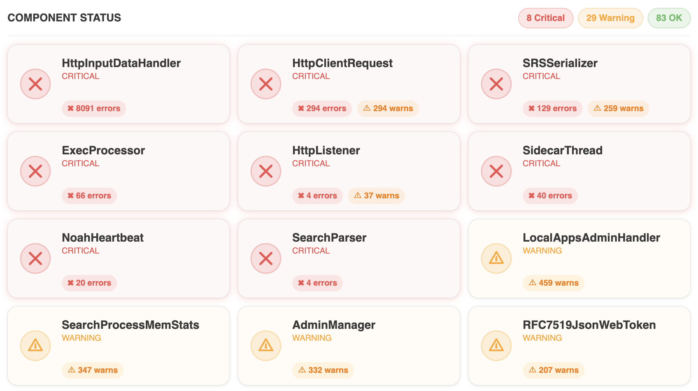
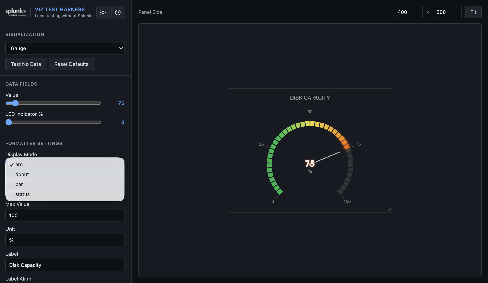

# Splunk Custom Visualizations

Build custom Splunk visualizations using Canvas 2D — with an AI-powered [Claude Code](https://docs.anthropic.com/en/docs/claude-code) skill that handles scaffolding, rendering logic, and best practices for you.

Splunk's built-in charts cover the basics, but sometimes your data deserves something more. Custom visualizations let you render search results exactly the way you want — gauges, heatmaps, status boards, network graphs, or anything you can draw on a canvas. This repo gives you everything you need to get started.

## What's Inside

```text
.claude/skills/splunk-viz/     Claude Code skill for generating custom vizs
examples/
  custom_single_value/         Working example: configurable single value display
  component_status_board/      Working example: NOC-style component health grid
  gauge/                       Working example: multi-mode gauge (arc, donut, bar, status)
build.sh                       Build and package any viz into an installable .tar.gz
test-harness.html              Browser-based testing without Splunk deployment
harness-manifest.json          Registry of vizs for the test harness
INSTRUCTIONS.md                Step-by-step setup and usage guide
TEST-HARNESS.md                Test harness documentation
```

## Quick Start

1. **Clone this repo** and open it in your editor
2. **Install [Claude Code](https://docs.anthropic.com/en/docs/claude-code)** if you haven't already
3. **Ask Claude to build a viz** e.g.:

   ```text
   Using /splunk-viz, create a custom visualization that shows a donut chart
   with a center label. It should accept "label" and "value" columns.
   ```

4. **Build and install**:

   ```bash
   ./build.sh my_viz_name
   $SPLUNK_HOME/bin/splunk install app dist/my_viz_name-1.0.0.tar.gz
   ```

See [INSTRUCTIONS.md](INSTRUCTIONS.md) for the full setup guide.

## The Splunk Viz Skill

The `.claude/skills/splunk-viz/` directory contains a Claude Code skill that knows how to:

- Scaffold a complete Splunk viz app (config files, formatter UI, webpack, build script)
- Generate Canvas 2D rendering code following Splunk's AMD module pattern
- Handle HiDPI displays, real-time data, responsive sizing, and font embedding
- Apply 24 battle-tested rules learned from building production visualizations

The skill is automatically available when you use Claude Code in this repo. Just describe what you want to visualize and it will generate the full app.

## Example: Custom Single Value

The `examples/custom_single_value/` directory is a complete, working visualization you can install immediately. It displays any search field with configurable:

- Text colour and glow effect
- Bold or regular weight
- Horizontal and vertical alignment
- Optional label with left, centre, or right alignment


```spl
| makeresults | eval value="Hello Splunk!"
```

## Example: Component Status Board

The `examples/component_status_board/` directory is a NOC-style status board that shows Splunk component health from the `_internal` index. Features:

- Responsive grid of colour-coded tiles (green/amber/red)
- Critical tiles glow and sort to the top; healthy tiles fade back
- Error and warning count badges on each tile
- Click any tile to drilldown to that component's logs
- Theme-aware — works on both light and dark dashboards



```spl
index=_internal sourcetype=splunkd log_level=* component=*
| stats count(eval(log_level="ERROR")) as errors
        count(eval(log_level="WARN")) as warns by component
| eval status=if(errors>0,"critical",if(warns>0,"warning","ok"))
```

## Example: Gauge

The `examples/gauge/` directory is a multi-mode gauge visualization with four display modes and eight colour schemes. Features:

- **Arc** — full 270-degree segmented gauge with needle, tick marks, and centre readout
- **Donut** — compact ring gauge with centre value
- **Bar** — horizontal segmented bar with label and value
- **Status** — on/off pill indicator for binary states
- Eight colour schemes (teal-red, green-red, blue-red, severity, and more)
- Optional LED indicator row above the arc
- Configurable glow effect on the leading edge
- Auto-scaling text and layout



```spl
| makeresults | eval value=75
```

Works with any numeric field — CPU usage, memory, disk, response times, queue depth, or any metric you want to visualise as a gauge.

## Test Harness

Iterate on your visualizations in the browser without deploying to Splunk:

```bash
python3 -m http.server 8080
```

Open [http://localhost:8080/test-harness.html](http://localhost:8080/test-harness.html) — select a viz, adjust sliders and settings, see the canvas update in real-time. Test the no-data state, resize the panel, and tweak formatter options — all without a Splunk instance.

Each viz includes a `harness.json` that defines interactive controls and sample data. The harness HTML is fully generic — no viz-specific code. See [TEST-HARNESS.md](TEST-HARNESS.md) for full documentation.

## Requirements

- **Splunk Enterprise 10.2+** or **Splunk Cloud**
- **Node.js 18+** (for building the webpack bundle)
- **Claude Code** (for using the AI skill)

## How It Works

Each visualization is a standalone Splunk app:

1. **`visualization_source.js`** — AMD module that extends `SplunkVisualizationBase`, receives search results, and draws on a `<canvas>` element
2. **`formatter.html`** — Splunk form components that expose settings in the dashboard Format panel
3. **Config files** — `app.conf`, `visualizations.conf`, `savedsearches.conf` register the viz with Splunk
4. **webpack** — Bundles the source into a single `visualization.js` that Splunk loads

The build script handles npm install, webpack bundling, and tarball packaging — excluding dev files from the final package.

Each viz is a standalone app by default, but you can also embed visualizations into an existing Splunk app. See [EMBEDDING.md](EMBEDDING.md) for instructions.

## Contributing

1. Create your viz in `examples/your_viz_name/` following the directory structure
2. Add a `harness.json` for browser testing and register it in `harness-manifest.json`
3. Use `./build.sh your_viz_name` to build and package
4. Test locally with the harness, then in Splunk, then submit a PR

## Licence

Apache 2.0 — see [LICENSE](LICENSE).
