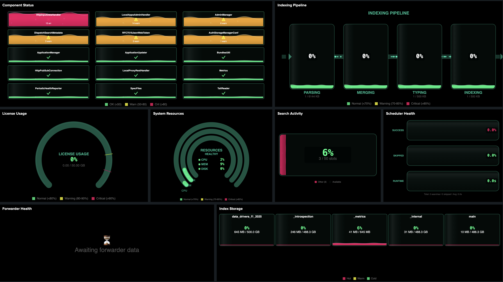
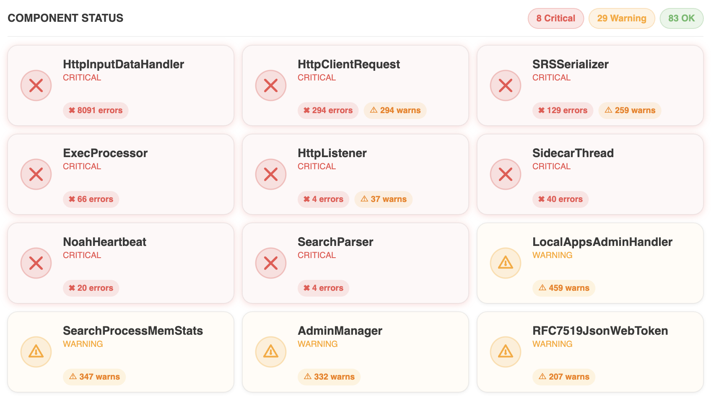
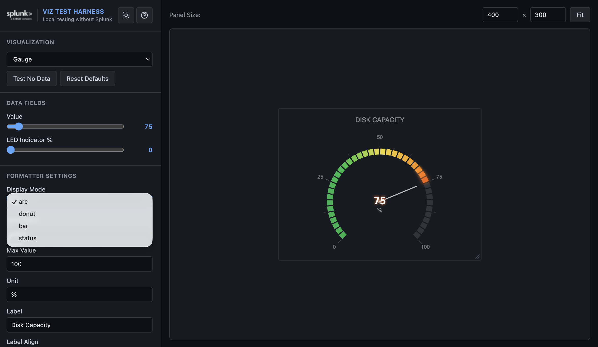

# Splunk Custom Visualizations

Build Canvas 2D custom visualizations for both the legacy Splunk visualization framework and the native Dashboard Studio extension framework—with a portable Agent Skill for Claude Code, Cursor, and Codex that handles scaffolding, rendering logic, testing, and packaging.

Splunk's built-in charts cover the basics, but sometimes your data deserves something more. Custom visualizations let you render search results exactly the way you want — gauges, heatmaps, status boards, network graphs, or anything you can draw on a canvas. This repo gives you everything you need to get started.

## What's Inside

```text
.agents/skills/splunk-viz/     Canonical cross-agent skill for generating custom vizs
.claude/skills/splunk-viz/     Thin Claude Code discovery adapter
AGENTS.md                       Shared repository instructions
CLAUDE.md                       Thin Claude Code repository adapter
examples/
  arcade_leaderboard/          Retro arcade-style scrolling leaderboard
  bet_flow_map/                Betting flow Sankey-style map
  bet_radar/                   Radar chart for betting metrics
  component_status_board/      NOC-style component health grid
  custom_single_value/         Configurable single value display
  data_pipeline/               Data pipeline flow visualization
  f1_ers/                      F1 energy recovery system gauge
  f1_track_info/               F1 track information display
  forwarder_heatmap/           Health: forwarder staleness heatmap grid
  gauge/                       Multi-mode gauge (arc, donut, bar, status)
  goal_timeline/               Goal timeline for match events
  index_storage/               Health: layered glass tanks showing index capacity
  index_universe/              Index universe explorer
  indexing_pipeline_flow/      Health: animated glass-tube pipeline queue monitor
  liability_gauge/             Liability exposure gauge
  license_gauge/               Health: arc gauge for daily license usage vs quota
  line_trend_chart/            Sparkline trend chart
  live_ticker/                 Scrolling live ticker tape
  market_donut/                Market share donut chart
  match_heatmap/               Match event heatmap
  network_topology/            Network topology graph
  odds_ticker/                 Live odds ticker display
  radar_chart/                 Multi-axis radar/spider chart
  resource_gauge/              Health: triple-arc CPU/Memory/Swap gauge
  scheduler_health/            Health: horizontal tube vital signs for scheduler
  search_activity/             Health: stacked glass tank for search slot utilization
  splunk_status_board/         Health: glass-themed component health tiles
  wc_bracket/                  World Cup tournament bracket
  worldcup_bets/               World Cup betting dashboard
splunk_health/                 Bundled app: all 8 health vizzes + Dashboard Studio dashboard
  build.sh                     Build, merge, and package into a single .tar.gz
build.sh                       Build and package any standalone viz
test-harness.html              Browser-based testing without Splunk deployment
harness-manifest.json          Registry of vizs for the test harness
studio-test-harness.html       Native Dashboard Studio iframe/API harness
studio-harness-manifest.json   Registry of native Studio extension bundles
INSTRUCTIONS.md                Step-by-step setup and usage guide
TEST-HARNESS.md                Test harness documentation
```

## Quick Start

1. **Clone this repo** and open it in your editor
2. **Open the repository in Claude Code, Cursor, or Codex.** All three discover the `splunk-viz` skill from the checked-in adapters.
3. **Ask your agent to build a viz**, for example:

   ```text
   Using splunk-viz, create a custom visualization that shows a donut chart
   with a center label. It should accept "label" and "value" columns.
   ```

4. **Build and install**:

   ```bash
   ./build.sh my_viz_name
   $SPLUNK_HOME/bin/splunk install app dist/my_viz_name-1.0.0.tar.gz
   ```

See [INSTRUCTIONS.md](INSTRUCTIONS.md) for the full setup guide.

**Try the test harness live:** [GitHub Pages Demo](https://rcastley.github.io/splunk-custom-visualizations/)

## Supported Agents

| Agent | Discovery path | Explicit invocation |
| --- | --- | --- |
| [Claude Code](https://code.claude.com/docs/en/skills) | Thin `.claude/skills/splunk-viz` adapter | `/splunk-viz` |
| [Cursor](https://cursor.com/docs/skills) | Canonical `.agents/skills/splunk-viz` package | `/splunk-viz` |
| [Codex](https://learn.chatgpt.com/docs/build-skills) | Canonical `.agents/skills/splunk-viz` package | `$splunk-viz` |

The canonical skill uses only the common Agent Skills `name` and `description` frontmatter. Host-specific permissions and settings stay outside the skill. Run `npm run validate:skill` after changing its metadata, references, or adapter.

## The Portable Splunk Viz Skill

The canonical skill in `.agents/skills/splunk-viz/` follows the open Agent Skills format and knows how to:

- Select and scaffold either the legacy `SplunkVisualizationBase` framework or the native Dashboard Studio extension framework
- Build legacy formatter/AMD/webpack apps and native Studio `config.json`/ES module/esbuild projects
- Scaffold a parent Dashboard Studio app with a `vizs/` pipeline for bundling legacy custom vizs
- Generate Canvas 2D rendering code following Splunk's AMD module pattern
- Generate native Studio adapters using `@splunk/dashboard-studio-extension` listeners or React hooks
- Handle HiDPI displays, real-time data, responsive sizing, and font embedding
- Smooth real-time numeric values with a client-side tween so gauges, bars, and motion elements don't snap between SPL samples
- Test each framework in its matching local harness and package it with the correct toolchain

The skill is automatically available in supported agents when you open this repository. Invoke it explicitly as `/splunk-viz` in Claude Code or Cursor, or `$splunk-viz` in Codex; all three can also select it automatically from the request. You can ask it to generate either a legacy custom visualization, a native Dashboard Studio extension, or both framework outputs.

## Example: Splunk Health Dashboard

The `splunk_health/` directory is a ready-to-deploy Splunk app that bundles eight glass-themed health monitoring visualizations into a single Dashboard Studio dashboard. All vizzes share the same design language — glass tubes, liquid fills, animated particles, and progressive glow effects.



| Visualization | Panel | What it shows |
| --- | --- | --- |
| **Splunk Status Board** | Component tiles | Health of Splunk components (Indexer, Search Head, KV Store, etc.) via `\| rest /services/server/health` |
| **License Gauge** | Arc gauge | Daily license consumption vs quota via `\| rest /services/licenser/pools` |
| **Resource Gauge** | Triple arc | CPU, Memory, and Swap utilization via `index=_introspection` |
| **Indexing Pipeline Flow** | Glass tubes | Queue fill levels for parsing → merging → typing → indexing via `index=_internal group=queue` |
| **Forwarder Heatmap** | Cell grid | Forwarder staleness — green (recent) → yellow (stale) → red (missing) via `index=_internal group=tcpin_connections` |
| **Search Activity** | Stacked glass tank | Search slot utilization by type (scheduled/ad-hoc/other) vs max concurrent via `\| rest /services/server/status` |
| **Scheduler Health** | Horizontal tubes | Success rate, skip rate, and avg runtime — vital signs for the search scheduler via `index=_internal sourcetype=scheduler` |
| **Index Storage** | Layered glass tanks | Per-index capacity usage with hot/warm/cold data temperature layers via `\| rest /services/data/indexes` |

Each visualization includes three colour themes (default, dark, neon), configurable warning/critical thresholds, and animated effects that intensify as conditions worsen.

### Build and install

```bash
./splunk_health/build.sh
```

This builds all eight vizzes from `examples/`, rewrites namespaces, merges configs, and packages `dist/splunk_health.tar.gz`. Upload via **Apps → Manage Apps → Install app from file**.

The dashboard auto-refreshes every 60 seconds. All searches include `appendpipe` fallbacks so panels show "Awaiting data" messages instead of blank placeholders.

### Standalone vizzes

Each visualization also exists as a standalone app in `examples/`:

- `examples/indexing_pipeline_flow/`
- `examples/splunk_status_board/`
- `examples/license_gauge/`
- `examples/forwarder_heatmap/`
- `examples/resource_gauge/`
- `examples/search_activity/`
- `examples/scheduler_health/`
- `examples/index_storage/`

Build any one individually with `./build.sh <name>`.

## Example: Custom Single Value

The `examples/custom_single_value/` directory is a complete, working visualization you can install immediately. It displays any search field with configurable:

- Text colour and glow effect
- Bold or regular weight
- Horizontal and vertical alignment
- Optional label with left, centre, or right alignment


```spl
| makeresults | eval value="Hello Splunk!"
```

## Example: Component Status Board

The `examples/component_status_board/` directory is a NOC-style status board that shows Splunk component health from the `_internal` index. Features:

- Responsive grid of colour-coded tiles (green/amber/red)
- Critical tiles glow and sort to the top; healthy tiles fade back
- Error and warning count badges on each tile
- Click any tile to drilldown to that component's logs
- Theme-aware — works on both light and dark dashboards



```spl
index=_internal sourcetype=splunkd log_level=* component=*
| stats count(eval(log_level="ERROR")) as errors
        count(eval(log_level="WARN")) as warns by component
| eval status=if(errors>0,"critical",if(warns>0,"warning","ok"))
```

## Example: Gauge

The `examples/gauge/` directory is a multi-mode gauge visualization with four display modes and eight colour schemes. Features:

- **Arc** — full 270-degree segmented gauge with needle, tick marks, and centre readout
- **Donut** — compact ring gauge with centre value
- **Bar** — horizontal segmented bar with label and value
- **Status** — on/off pill indicator for binary states
- Eight colour schemes (teal-red, green-red, blue-red, severity, and more)
- Optional LED indicator row above the arc
- Configurable glow effect on the leading edge
- Auto-scaling text and layout



```spl
| makeresults | eval value=75
```

Works with any numeric field — CPU usage, memory, disk, response times, queue depth, or any metric you want to visualise as a gauge.

## Test Harness

Iterate on your visualizations in the browser without deploying to Splunk:

```bash
python3 -m http.server 8080
```

Open [http://localhost:8080/test-harness.html](http://localhost:8080/test-harness.html) — select a viz, adjust sliders and settings, see the canvas update in real-time. Test the no-data state, resize the panel, and tweak formatter options — all without a Splunk instance.

For native extensions, open [http://localhost:8080/studio-test-harness.html](http://localhost:8080/studio-test-harness.html). It derives interactive option controls from `config.json`, provides an editable columnar data grid, and exposes loading, no-data, size, theme, mode, reset, and reload controls. Raw JSON is available under **Advanced state** for malformed and multi-source test cases.

Each viz includes a `harness.json` that supplies sample data. Both harnesses are generic and contain no visualization-specific code. See [TEST-HARNESS.md](TEST-HARNESS.md) for full documentation.

## Requirements

- **Splunk Enterprise 10.2+** or **Splunk Cloud**
- **Node.js 22+** (for the legacy webpack build and native Studio CLI/esbuild toolchain)
- **Claude Code, Cursor, or Codex** (for using the portable Agent Skill)

## How It Works

Each visualization is a standalone Splunk app:

1. **`visualization_source.js`** — AMD module that extends `SplunkVisualizationBase`, receives search results, and draws on a `<canvas>` element
2. **`formatter.html`** — Splunk form components that expose settings in the dashboard Format panel
3. **Config files** — `app.conf`, `visualizations.conf`, `savedsearches.conf` register the viz with Splunk
4. **webpack** — Bundles the source into a single `visualization.js` that Splunk loads

The build script handles npm install, webpack bundling, and tarball packaging — excluding dev files from the final package.

Each viz is a standalone app by default, but you can also embed visualizations into an existing Splunk app — either [manually](EMBEDDING.md) or by scaffolding a Dashboard Studio app with an automated build pipeline (see [EMBEDDING.md](EMBEDDING.md)).

## Contributing

1. Create your viz in `examples/your_viz_name/` following the directory structure
2. Add a `harness.json` for browser testing and register it in `harness-manifest.json`
3. Use `./build.sh your_viz_name` to build and package
4. Test locally with the harness, then in Splunk, then submit a PR

## Licence

Apache 2.0 — see [LICENSE](LICENSE).
